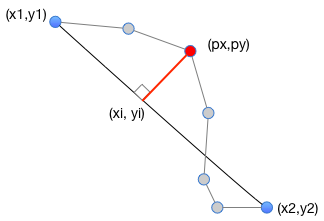
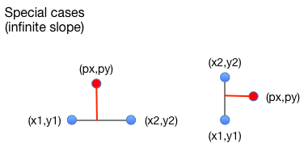
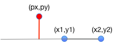

# Dropping a normal

We have a line segment (x1,y1) to (x2,y2).  We want to determine the distance from (px,py) to that segment.  

The *shortest* distance from (px,py) to the segment is along a ray perpendicular to the segment, called a *normal*.  We can calculate that distance using the standard formula if we find the point where the normal intercepts the segment. 

Start by finding the slope of the line segment (x1,y1) to (x2, y2), which is (y2-y1)/(x2-x1).  Call this m1. 

The slope of the normal is -1/m1.  For example, if you have a line of slope 1, perpindiculars to that line will have slope -1, and if you have a line of slope 1/2, perpendiculars to that line will have a slope of -2.   We'll call the slope of the normal m2.  

The rest is basic algebra.  Recall that the formula for a line on the cartesian plane can be written as y = mx + b, where m is the slope and b is the y-intercept.  We have sample x and y values, and we have the slopes m; we just need the values b to have a pair of simultaneous equations which can be solved to find their intersection.  

We can rewrite y = mx + b as b = y - mx to solve for b.  Do this for both the original segment and the normal segment.  We'll call the y-intercept of the original segment b1, and the y-intercept of the normal segment b2. Now we have all the coefficients for a line that includes the original segment and a line that includes the normal ray.  

Next we want to find the point (xi, yi) where the normal ray intersects the segment (or the line passing through the segment).  Since we have the formula for both in slope-intercept form, we can easily solve to find their intersection by combining them.  xi is (b2 - b1)/(m2 - m1), and yi is m2*xi + b2.  

Now that we have (xi,yi) as well as the original (px,py), we can apply the usual distance formula to find the length of the normal segment. 

## Special cases 

There are a few special cases we need to be careful of.  First, what if the segment is vertical or horizontal?  Then either the slope of the segment or the slope of its normal is undefined: 

Fortunately these cases are very simple to deal with.  If the segment (x1,y1) to (x2,y2) is horizontal (that is, y1 == y2), then the distance to the intercept with the normal is just |py-y1|.  If the segment is vertical, then the distance to the intercept is just 
|px-x1|.  

There is one more case we might worry about.  We have calculated the distance of a normal to the *line through* the segment (x1,y1) to (x2,y2).  What if this normal intersects the line outside the segment? 

It would not be too hard to recognize this case and use the distance from (px,py) to one of the endpoints, (x1,y1) or (x2,y2).  However, I do not believe this case will cause a problem in the context of the Douglas-Peucker line simplification algorithm.  We should produce some test cases to increase our confidence that this is ok. 